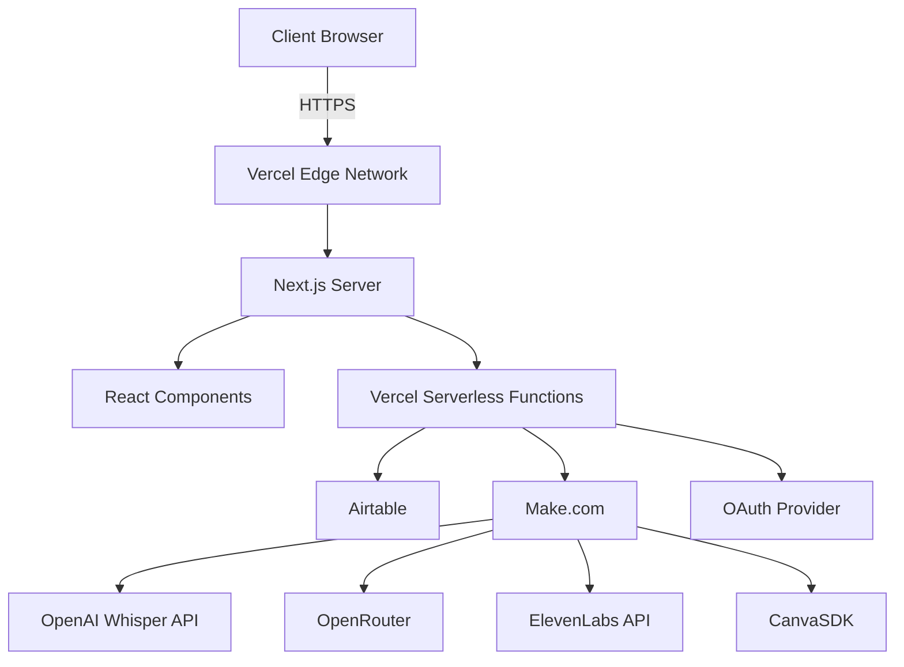
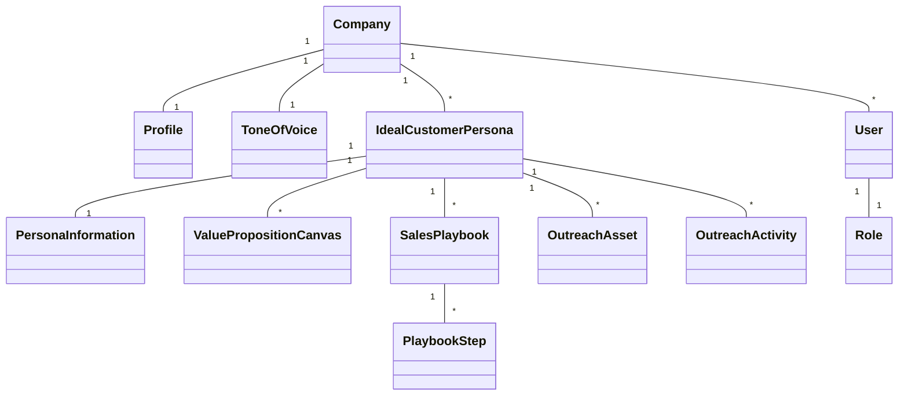
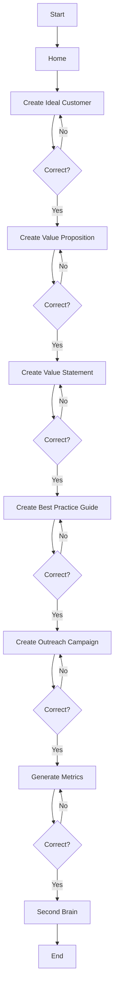
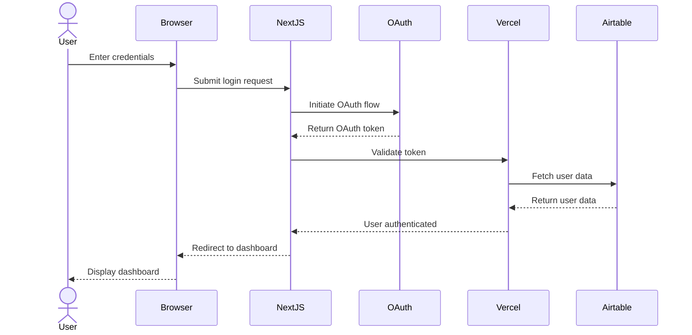
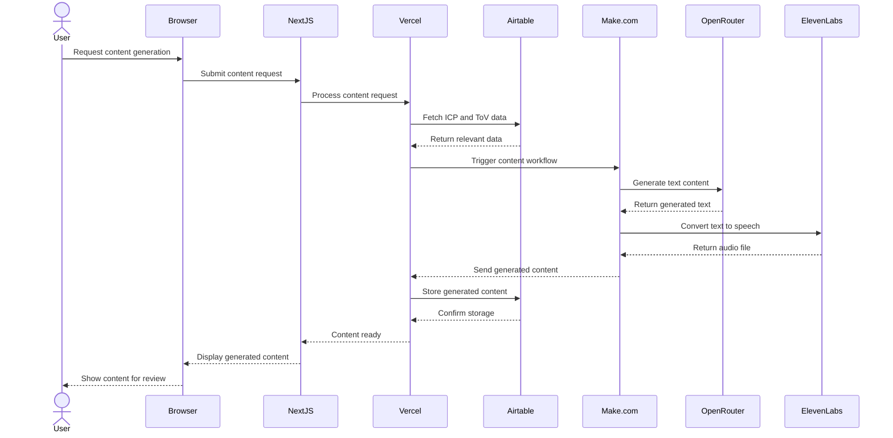

## 1. App Overview and Objectives

The Apgeri AI Platform is a web-based application designed to empower sales and marketing professionals with AI-driven content creation and playbook management. The platform streamlines the process of creating tailored content for ideal customer personas, manages sales playbooks, and provides analytics for performance tracking.

Key objectives:
- Facilitate rapid content creation using AI workflows.
- Manage company profiles, customer personas, and sales playbooks.
- Provide role-based access to different features.
- Enable performance tracking through custom KPIs.

## 2. Target Audience

Primary users:
- Sales professionals
- Marketing professionals
- Sales/marketing managers
- Sales/marketing coaches

Scale: MVP up to 10 companies, with a maximum of 10 users per company

## 3. Functional Requirements

1. User Authentication and Role Management
   - Implement an OAuth-based authentication system.
   - Create three user roles: General users, Managers, and Coaches.
   - Develop role-based access control for features and data.

2. Company Profile Management
   - Create and edit a single profile per company.
   - Include attributes: size, industry, location, business model, etc.

3. Tone of Voice (ToV) Management
   - Develop interface for managing single ToV per company.
   - Include attributes such as brand voice guidelines, excluded words, writing grade level, and language.

4. Ideal Customer Persona (ICP) Management
   - Create a system for managing multiple ICPs per company.
   - Develop an interface for inputting personal information, such as role overview, responsibilities, challenges, goals, etc.

5. Value Proposition Canvas
   - Implement a tool for creating multiple canvases per ICP.
   - Include attributes: customer jobs, pains, gains, products & services, pain relievers, and gain creators.

6. Sales Playbook Management
   - Develop a system for creating and managing multiple playbooks per ICP.
   - Implement a four-step structure: Benchmark, Contextualise, Enhance, and Measure.
   - Include types: buyer journey mapping, qualification methodology, engagement techniques, etc.

7. Outreach Asset Management
   - Create a system for managing multiple assets per ICP.
   - Include types: blog posts, newsletters, proposals, case studies, podcasts, YouTube videos, ebooks, testimonials, and landing pages.

8. Outreach Activity Management
   - Develop a tool for managing multiple activities per ICP.
   - Include types: email campaigns, social media campaigns, and PPC campaigns.

9. AI-Powered Content Generation
   - Integrate with Make.com to trigger AI workflows.
   - Implement AI-driven content generation based on company and ICP data.
   - Develop review and editing interface for AI-generated content.

10. Analytics and Reporting
    - Create a KPI-based performance tracking system.
    - Develop a customisable reporting interface.

11. Search Functionality
    - Implement a global search feature for all content.

12. Content Creation Interface
    - Develop intuitive forms for data input and content creation.
    - Implement AI process triggering upon form submission.

13. Dashboard and Navigation
    - Create a dashboard-style interface with side navigation.
    - Implement a collapsible side nav with sections for company, Persona, Value Proposition, Playbook, Outreach, and Campaigns.
    - Develop a main content area for displaying selected content or forms.

14. Markdown Rendering
    - Implement Markdown rendering for content display.
    - Create an editing interface for sales managers.

15. Workflow Implementation
    - Develop customer workflow: Ideal Customer + ToV > Value Canvas > Value Statement.
    - Implement best practice workflow: Buyer Journey > Qualification Methodology > Various Techniques > Four-step process
    - Create outreach workflow: Content Types > Campaign Types.

16. Integration with AI Services
    - Integrate OpenAI Whisper API for advanced speech recognition.
    - Implement OpenRouter to gain access to multiple AI models.
    - Integrate ElevenLabs API for text-to-speech functionality.

17. CanvaSDK Integration
    - Implement CanvaSDK for programmatic access to design capabilities.

## 4. Non-Functional Requirements

1. Performance
   - Optimise applications for fast load times and responsiveness.
   - Implement caching strategies for frequently accessed data.
   - Optimise API calls to external services.

2. Scalability
   - Design system to handle up to 10 companies with ten users each
   - Prepare for potential migration from Airtable to a more scalable database solution.

3. Security
   - Enforce HTTPS across the entire application.
   - Implement secure storage of API keys and secrets using environment variables.
   - Conduct regular security audits and dependency updates.

4. Usability
   - Design intuitive and user-friendly interfaces.
   - Implement responsive design for various screen sizes.
   - Ensure consistency in UI elements and interactions.

5. Reliability
   - Implement error handling and logging mechanisms.
   - Develop automated testing suite, including unit and integration tests.

6. Maintainability
   - Use consistent coding standards and best practices.
   - Implement proper documentation for codebase and APIs
   - Set up CI/CD pipeline for automated testing and deployment.
## 5. Technical Stack

- Front-End: React with Next.js, TypeScript, Tailwind CSS
- Back-End: Vercel (serverless functions), Airtable (data storage)
- Authentication: OAuth
- Version Control & CI/CD: GitHub, GitHub Actions
- Testing: Jest, React Testing Library
- Integration & Automation: Make.com
- AI Services: OpenAI Whisper API, OpenRouter, ElevenLabs API
- Additional APIs: CanvaSDK
- Deployment: Vercel

## 6. Data Model

1. Company
   - OneToOne: Profile
   - OneToOne: ToneOfVoice
   - OneToMany: IdealCustomerPersona
   - OneToMany: User

2. IdealCustomerPersona
   - OneToOne: personal information
   - OneToMany: ValuePropositionCanvas
   - OneToMany: SalesPlaybook
   - OneToMany: OutreachAsset
   - OneToMany: OutreachActivity

3. SalesPlaybook
   - OneToMany: PlaybookStep

4. User
   - OneToOne: Role

## 7. Potential Challenges and Solutions

1. Challenge: Ensuring AI-generated content quality
   Solution: Implement human review processes and iterative improvement of AI models

2. Challenge: Scalability with Airtable as primary data storage
   Solution: Monitor performance and prepare for potential migration to a more scalable database solution

3. Challenge: Maintaining performance with complex AI integrations
   Solution: Implement caching strategies and optimise API calls

4. Challenge: Ensuring data privacy and security
   Solution: Regular security audits, encryption of sensitive data, and strict access controls

## 8. Future Expansion Possibilities

1. Integration with CRM systems (e.g., Hubspot)
2. Mobile app development for on-the-go access
3. Advanced AI features such as predictive analytics and personalised recommendations
4. Expansion of outreach channels and content types
5. White-labeling options for larger clients
6. API development for third-party integrations

## 9. Apgeri AI Platform Diagrams

### 1. System Architecture Diagram

#### 1. System Architecture Code

graph TD
    A[Client Browser] -->|HTTPS| B[Vercel Edge Network]
    B --> C[Next.js Server]
    C --> D[React Components]
    C --> E[Vercel Serverless Functions]
    E --> F[Airtable]
    E --> G[Make.com]
    G --> H[OpenAI Whisper API]
    G --> I[OpenRouter]
    G --> J[ElevenLabs API]
    G --> K[CanvaSDK]
    E --> L[OAuth Provider]

### 2. Data Model Diagram

#### 2. Data Model Code

classDiagram
    Company "1" -- "1" Profile
    Company "1" -- "1" ToneOfVoice
    Company "1" -- "*" IdealCustomerPersona
    Company "1" -- "*" User
    IdealCustomerPersona "1" -- "1" PersonaInformation
    IdealCustomerPersona "1" -- "*" ValuePropositionCanvas
    IdealCustomerPersona "1" -- "*" SalesPlaybook
    IdealCustomerPersona "1" -- "*" OutreachAsset
    IdealCustomerPersona "1" -- "*" OutreachActivity
    SalesPlaybook "1" -- "*" PlaybookStep
    User "1" -- "1" Role

### 3. Main Workflow Diagram

#### 3. Main workflow  code

flowchart TD
    A[Start] --> B[Home]
    B --> C[Create Ideal Customer]
    C --> D{Correct?}
    D -->|No| C
    D -->|Yes| E[Create Value Proposition]
    E --> F{Correct?}
    F -->|No| E
    F -->|Yes| G[Create Value Statement]
    G --> H{Correct?}
    H -->|No| G
    H -->|Yes| I[Create Best Practice Guide]
    I --> J{Correct?}
    J -->|No| I
    J -->|Yes| K[Create Outreach Campaign]
    K --> L{Correct?}
    L -->|No| K
    L -->|Yes| M[Generate Metrics]
    M --> N{Correct?}
    N -->|No| M
    N -->|Yes| O[Second Brain]
    O --> P[End]

### 4. Login workflow

#### 4. Login  code

sequenceDiagram
    actor User
    participant Browser
    participant NextJS
    participant OAuth
    participant Vercel
    participant Airtable

    User->>Browser: Enter credentials
    Browser->>NextJS: Submit login request
    NextJS->>OAuth: Initiate OAuth flow
    OAuth-->>NextJS: Return OAuth token
    NextJS->>Vercel: Validate token
    Vercel->>Airtable: Fetch user data
    Airtable-->>Vercel: Return user data
    Vercel-->>NextJS: User authenticated
    NextJS-->>Browser: Redirect to dashboard
    Browser-->>User: Display dashboard
    
### 4. Generate Workflow

#### 5. Generate Workflow code

sequenceDiagram
    actor User
    participant Browser
    participant NextJS
    participant Vercel
    participant Airtable
    participant Make.com
    participant OpenRouter
    participant ElevenLabs

    User->>Browser: Request content generation
    Browser->>NextJS: Submit content request
    NextJS->>Vercel: Process content request
    Vercel->>Airtable: Fetch ICP and ToV data
    Airtable-->>Vercel: Return relevant data
    Vercel->>Make.com: Trigger content workflow
    Make.com->>OpenRouter: Generate text content
    OpenRouter-->>Make.com: Return generated text
    Make.com->>ElevenLabs: Convert text to speech
    ElevenLabs-->>Make.com: Return audio file
    Make.com-->>Vercel: Send generated content
    Vercel->>Airtable: Store generated content
    Airtable-->>Vercel: Confirm storage
    Vercel-->>NextJS: Content ready
    NextJS-->>Browser: Display generated content
    Browser-->>User: Show content for review
